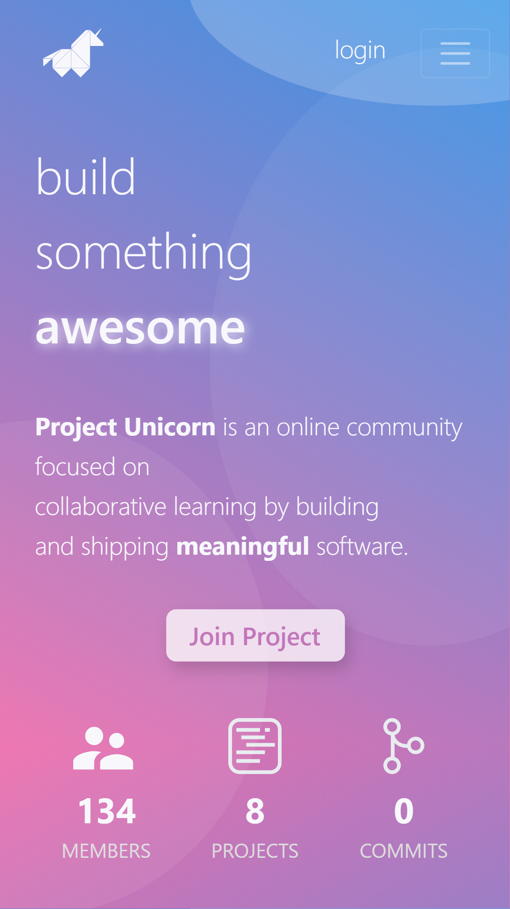
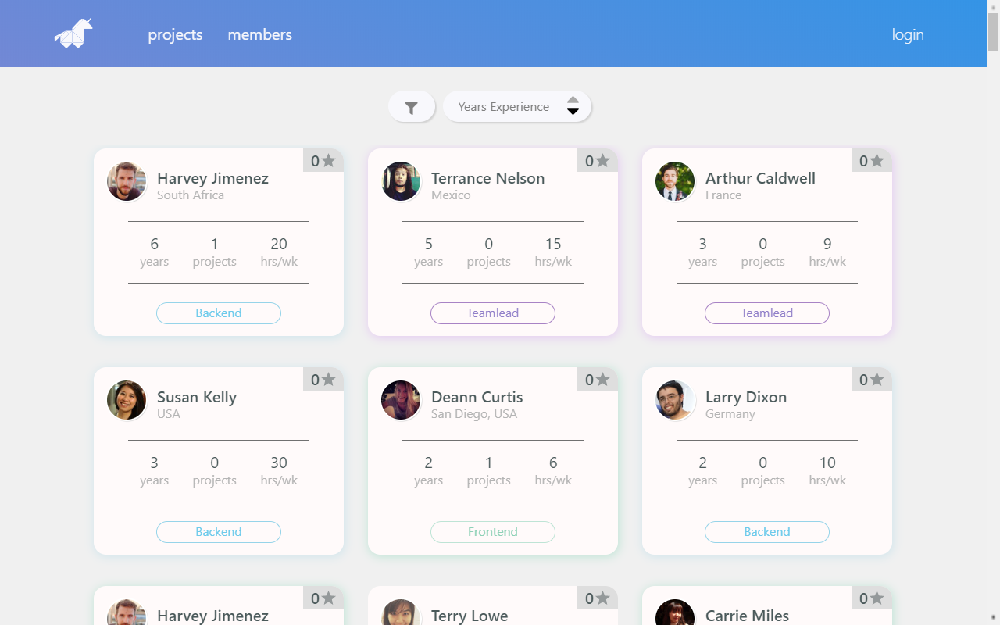
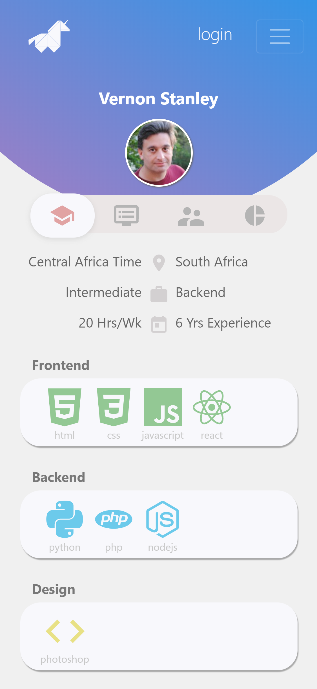
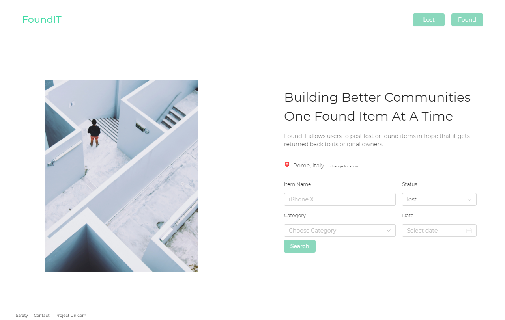
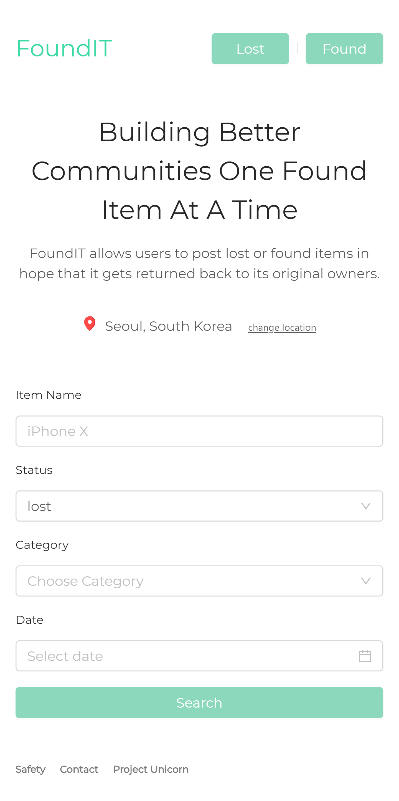
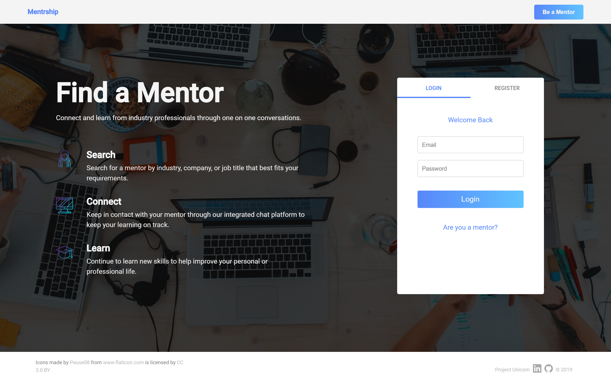
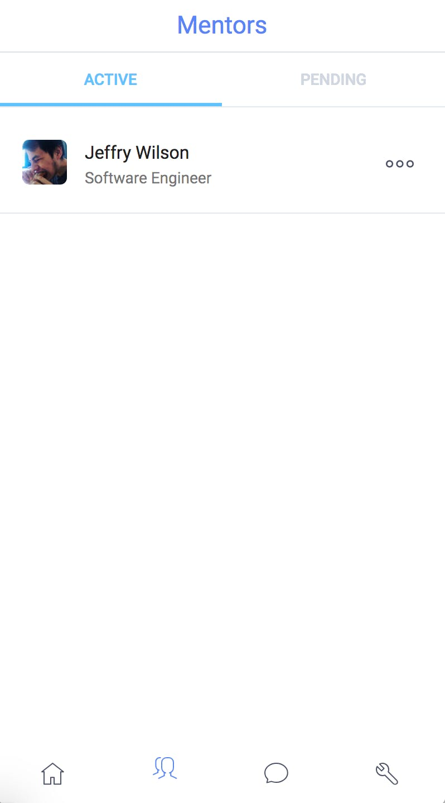

We're happy to announce the launch of the Go Apply web site! As part of
this announcement, we're also showcasing some of the projects made by our
awesome members.

## Go Apply UI

> A frontend to streamline the starting and joining of projects on the project
> unicorn slack team.

[Live](https://projectunicorn.dev) |
[Front-end repo](https://github.com/projectUnic0rn/project-unicorn-ui) |
[Back-end repo](https://github.com/projectUnic0rn/project-unicorn-api) |
[Blog Post](/blog/project-unicorn-ui)

### Core Features

- Filtering on UI to view projects currently active on the slack team
- Filtering on UI for members available to join a project
- Ability to start/join a project through the UI
- Integration with Slack API to act as the frontend notification system, and build out slash commands
- Integration with GitHub API to automate setting up of GitHub project teams/repos

### Screenshots

## FoundIT

> FoundIT allows users to post lost or found items in hope that it gets returned
> back to its original owners.

[Live](https://foundit.herokuapp.com) |
[Front-end repo](https://github.com/projectunic0rn/foundit-ui) |
[Back-end repo](https://github.com/projectunic0rn/foundit-api)

### Core Features

- Posting of lost items
- Searching for lost or found items
- Form for lost and found items

### Screenshots

## Mentrship

> A mentoring platform to connect industry professionals with students.

[Live](https://www.mentrship.com) |
[Front-end repo](https://github.com/projectunic0rn/mentorship-ui) |
[Back-end repo](https://github.com/projectunic0rn/mentorship-services)

### Core Features

- Ability for student to find and request mentor based on industry
- Ability for mentor to accept request
- Ability to message chat between mentor and student
- Ability to rate student and mentor based on experience

### Screenshots

That's it for now. Thank you for reading.

If you're interested in teaming up with developers around the world to build and
deploy meaningful software, you can apply to join the Go Apply slack
using the form linked below.

> [**Apply to join**](https://forms.gle/wPFAPmUSyALMbjhF7) 👈
